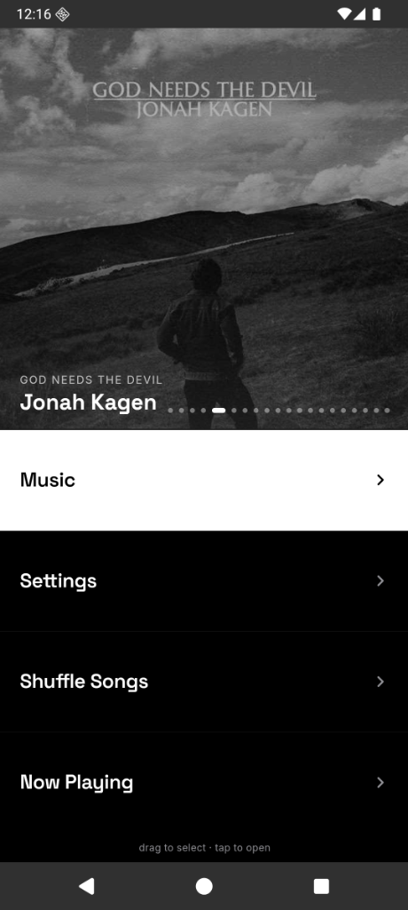
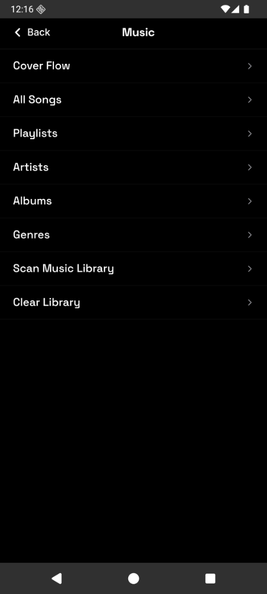
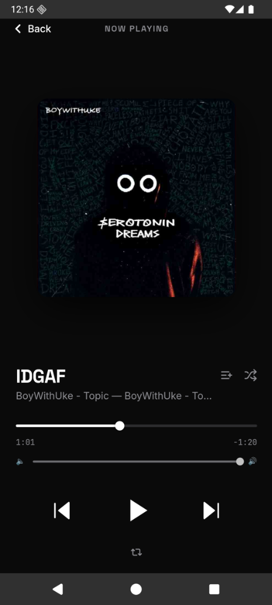
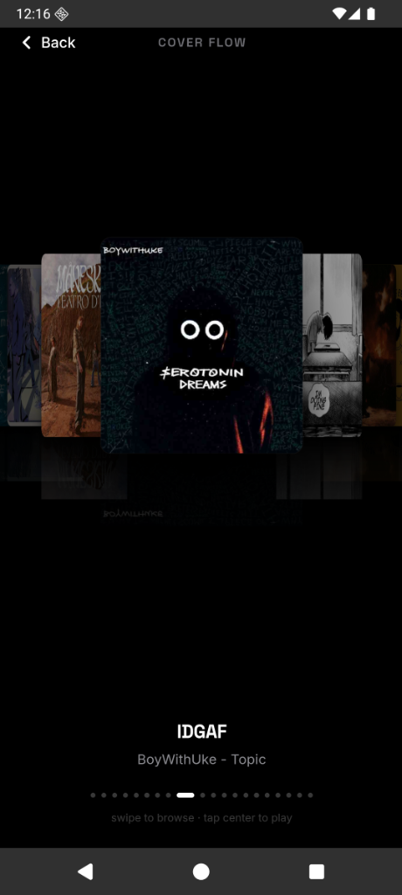

# Music Pod

A beautifully designed, modern local music player built with React, Vite, and Capacitor. Designed for Android and tailored for a seamless, premium listening experience.

## Features

- 🎵 **Local Music Playback**: Scans and plays all your local audio files directly from your device.
- 🎨 **Cover Flow**: A stunning, fluid 3D Cover Flow view to browse your albums visually.
- 🌑 **Premium Themes**: Includes high-end, professional themes like Classic Silver and Space Black.
- 🎛️ **Audio Crossfade**: Seamlessly transition between tracks for uninterrupted listening.
- 📂 **Full Library Management**: Browse your music by Songs, Albums, Artists, Genres, or Playlists.
- ⚡ **Optimized for 10k+ Songs**: Uses a virtualized list architecture to smoothly handle massive libraries without lag.

## Screenshots

<div align="center">
  
  
  
  
</div>

## Download & Install

You can download the latest compiled Android APK directly from the [Releases](https://github.com/Aarush47/Music-Pod/releases) section (or from the `releases/` folder in this repository) and install it on your Android device.

## Tech Stack

- **Frontend**: React + TypeScript + Vite
- **Mobile Runtime**: Ionic Capacitor (Android)
- **Styling**: Tailwind CSS + Custom CSS Variables
- **Audio Processing**: Web Audio API

## Getting Started (Development)

To run this project locally and build it yourself:

1. **Install dependencies**:
   ```bash
   npm install
   ```
2. **Run in browser**:
   ```bash
   npm run dev
   ```
3. **Build and sync for Android**:
   ```bash
   npm run build
   npx cap sync android
   ```
4. **Deploy to Android Emulator or Device**:
   ```bash
   npx cap run android
   ```

## License

MIT License. Feel free to fork, modify, and distribute.